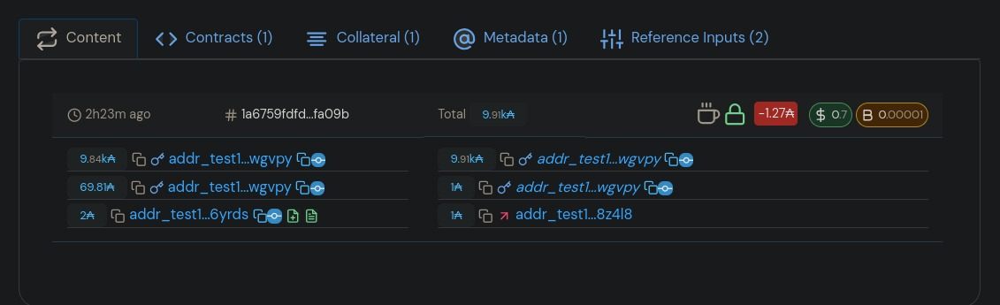

# Using the Orcfax ADA-USD price feed Datum with Opshin and PyCardano

For further information see:

* [OpShin][links-1].
* [PyCardano][links-2].

[links-1]: https://github.com/OpShin/opshin
[links-2]: https://pycardano.readthedocs.io/en/latest/tutorial.html

## Script background

The script allows a claimant to receive a small deposited fee from another
wallet provided the conditions of the smart contract are met.

The smart contract must check the following:

* an Orcfax price-feed datum was published by the real Oracle (this is true when
the UTxO contains a token created with the correct minting policy).
* the value of the price on-chain has not exceeded set boundaries.
* a small token fee has been paid to collect a deposited value.

The latest published Orcfax datum must be identified off-chain then the
transaction must be created and submitted to a cardano node.

### Script status

The current iteration of this work does not attempt to simulate entirely
real-world conditions involving multiple wallets. Instead, using Cardano's
unique qualities every transaction happens between the same wallet. This
simplifies this demo work by allowing one wallet to be funded. The process
is repeatable over-and-over again with minimal depletion of funds allowing
developers to try things out more easily.

### The DApp contract example using the Datum

The smart contract is used to verify a small fee has been paid and that the
current price on-chain does not exceed a configured limit. The limit can be
easily configured so that developers can observe the different behaviors of
the smart contract.

## The wallets

A single payment address is used throughout the examples.

All the payment addresses are obtained by starting from the same seed phrase,
using different derivation paths.

Seed phrase example:

<!-- markdownlint-disable -->

```text
penalty style orient dinner fabric gift genuine problem over february hybrid material pottery ensure pond annual icon pole dish decide embody able connect four
```

<!-- markdownlint-enable -->

With the virtual environment (venv) setup (below) you can create a phrase with
the following script call:

```sh
python generate_mnemonic_phrase.py
```

> Note: If the script has already been run once and a Bip32 pass phrase file
> exists the command will output the phrase and the associated wallet addresses
> without overwriting anything. This can be helpful to remind yourself of the
> addresses that you're working with. (do not run the script in public or on
> mainnet!)
>
> The generate script should create a `.wallet` folder within the repository. If
> the script has any difficulties creating this, please try creating it manually
> and then running `generate_mnemonic_phrase.py` again.

### Funding wallets

Having used `generate_mnemonic_phrase.py` to create a wallet address or see the
existing address value you can proceed to fund it.

#### Wallet funding

Given a preprod wallet, it can be funded from the Cardano [Faucet][faucet-1].
Directions on how to use this service can be found on the faucet website.

[faucet-1]: https://docs.cardano.org/cardano-testnet/tools/faucet/

All the funds that are required for this demo will be contained in this
wallet. In total the wallet only needs about 75 ADA.

#### Funding amounts

The script `generate_mnemonic_phrase.py` will output addresses below the seed phrase with feedback
as follows:

```text
payment addr (requires ⩾ 75 ADA): 'addr_test1qrc...e3'
```

We can see the wallets need to be funded as follows:

* Payment wallet: ⩾ 75 ADA, 1 UTxO.

## Installing and using the contracts

All the contracts are in distinct folders, arranged by the order in which they
will be used. The configuration for each smart contract is in the `config.py`
file, and the `library.py` contains a few functions and assigns a few variables
that are used by the other scripts.

To complete the steps, preferably install a new venv with the required packages.

```shell
python3 -m venv venv
```

Activate the virtual environment:

```shell
source venv/bin/activate
```

> NB. from hereon out `python` can be called as an alias for `python3` although
> will work just fine.

Install the required modules:

```shell
python -m pip install --upgrade pip
python -m pip install -r requirements/local.txt
```

Now that the virtual environment (venv) has been steablished, you can create a seed phrase for wallet generation with
the following script call:

```sh
python generate_mnemonic_phrase.py
```

Copying the preprod address generated, proceed to fund from the Cardano [Faucet][faucet-1].
Directions on how to use this service can be found on the faucet website.

[faucet-1]: https://docs.cardano.org/cardano-testnet/tools/faucet/

### The Example DApp contract using an Orcfax datum

#### tl;dr

The included `Makefile` provides a shortcut for running each of the commands
below. This helps with repeating the different steps.

In order, you will want to do the following:

```sh
make build-contract
make deploy-contract
make deposit-funds
make claim-funds
make undeploy-contract
```

The `deposit` and `claim` commands can be run as many times as you would like.
The `claim.py` script might, for example, be modified to edit the transaction
metadata to output something different. Run those with:

```sh
make deposit-funds
make claim-funds
```

> Note: with the added convenience, make sure to leave ~30-60 seconds between
> commands to make sure all the transactions have made it on-chain. Given any
> errors, just run the command again.
>
> additionally: if funds are deposited without being claimed, run
> `make refund-deposit` to claim that value back.

`make` can be run to view more information:

```text
build-contract                 Build the Oracle smart contract.
claim-funds                    Claim the deposited funds.
deploy-contract                Deploy the Oracle smart contract.
deposit-funds                  Deposit funds to be claimed.
help                           Print this help message.
lint-contract                  Lint the smart contract.
refund-deposit                 Refund deposited funds.
undeploy-contract              Un-deploy the Oracle smart contract.
```

##### Full DApp instructions

The DApp contract can be built by running:

```shell
opshin build spending contract.py
```

The contract can be deployed on-chain as a Script Output and referenced when
being used. This is done by running the `01.deploy.py` script:

```shell
python 01.deploy.py
```

The script output looks like this:

<!-- markdownlint-disable -->

```text
2024-02-08T15:17:53Z INFO :: 01.deploy.py:32:deploy_contract() :: script deployer address: addr_test1qq9tjzu93xw6dt4d3prx8g8w9mnfwf3nd83aqh36y2rnae53k0r4s5fvwhelthchhx785kmxaw3eesnsxdh74k8ksgvqwwgvpy
2024-02-08T15:17:53Z INFO :: 01.deploy.py:33:deploy_contract() :: script address: addr_test1wqzxql6x07lufr2ld5dhq7e0k27zdj4e346fd280p2dr43cf6e3r6
2024-02-08T15:17:53Z INFO :: 01.deploy.py:34:deploy_contract() :: fee address derived from payment address: addr1vy9tjzu93xw6dt4d3prx8g8w9mnfwf3nd83aqh36y2rnaes40kfsz
2024-02-08T15:17:53Z INFO :: 01.deploy.py:38:deploy_contract() :: fee address PKH: 0ab90b85899da6aead884663a0ee2ee697263369e3d05e3a22873ee6
2024-02-08T15:17:53Z INFO :: 01.deploy.py:42:deploy_contract() :: creating the transaction...
2024-02-08T15:17:53Z INFO :: 01.deploy.py:50:deploy_contract() :: signing the transaction...
2024-02-08T15:17:55Z INFO :: 01.deploy.py:54:deploy_contract() :: signed tx id: 53af2ab19fe2d80a02296508a48c329b5c751c35a84e08027a6270a47f690148
2024-02-08T15:17:55Z INFO :: library.py:55:save_transaction() :: saving Tx to: tx_client_deploy.signed , inspect with: 'cardano-cli transaction view --tx-file tx_client_deploy.signed'
2024-02-08T15:17:55Z INFO :: 01.deploy.py:56:deploy_contract() :: submitting the transaction...
2024-02-08T15:17:56Z INFO :: library.py:82:submit_and_log_tx() :: fee 0.419205 ADA
2024-02-08T15:17:56Z INFO :: library.py:86:submit_and_log_tx() :: output 70.0 ADA
2024-02-08T15:17:56Z INFO :: library.py:90:submit_and_log_tx() :: transaction submitted: https://preprod.cexplorer.io/tx/53af2ab19fe2d80a02296508a48c329b5c751c35a84e08027a6270a47f690148
2024-02-08T15:17:56Z INFO :: 01.deploy.py:58:deploy_contract() :: done
```

<!-- markdownlint-enable -->

From the wallets that we have already funded, the contract owner or user
(the `client`) needs to deposit an amount of ADA (and tokens) to the contract
address. This will set the following parameters in the datum:

* who is the `owner` of the funds (who can claim them)
* what fee and to which address should be paid when claiming the funds

The funds can be deposited by running the `02.deposit.py` script:

```shell
python 02.deposit.py
```

The script will output some logging that may be useful in debugging if at all
necessary, e.g. the publisher address can be queried to ensure that it is funded
correctly, and the smart contract address to ensure that it is on-chain.

<!-- markdownlint-disable -->

```text
2024-02-08T15:18:46Z INFO :: 02.deposit.py:29:deposit_value() :: script address: addr_test1wqzxql6x07lufr2ld5dhq7e0k27zdj4e346fd280p2dr43cf6e3r6
2024-02-08T15:18:46Z INFO :: 02.deposit.py:30:deposit_value() :: fee address: addr_test1vq9tjzu93xw6dt4d3prx8g8w9mnfwf3nd83aqh36y2rnaesw8z4l8
2024-02-08T15:18:46Z INFO :: 02.deposit.py:36:deposit_value() :: creating the transaction...
2024-02-08T15:18:46Z INFO :: 02.deposit.py:43:deposit_value() :: signing the transaction...
2024-02-08T15:18:48Z INFO :: 02.deposit.py:47:deposit_value() :: signed tx id: 5a53a680cf631786f872d53351429e828e513a0e4b7ca16ce680d8ba891970d7
2024-02-08T15:18:48Z INFO :: library.py:55:save_transaction() :: saving Tx to: tx_client_deposit.signed , inspect with: 'cardano-cli transaction view --tx-file tx_client_deposit.signed'
2024-02-08T15:18:48Z INFO :: library.py:82:submit_and_log_tx() :: fee 0.170253 ADA
2024-02-08T15:18:48Z INFO :: library.py:86:submit_and_log_tx() :: output 2.0 ADA
2024-02-08T15:18:48Z INFO :: library.py:90:submit_and_log_tx() :: transaction submitted: https://preprod.cexplorer.io/tx/5a53a680cf631786f872d53351429e828e513a0e4b7ca16ce680d8ba891970d7
```

<!-- markdownlint-emable -->

The beneficiary can claim the funds by running:

```shell
python 03.claim.py
```

<!-- markdownlint-disable -->

```text
2024-02-08T15:20:05Z INFO :: 03.claim.py:94:claim_script() :: script address: addr_test1wqzxql6x07lufr2ld5dhq7e0k27zdj4e346fd280p2dr43cf6e3r6
2024-02-08T15:20:05Z INFO :: 03.claim.py:95:claim_script() :: entering this script...
2024-02-08T15:20:05Z INFO :: 03.claim.py:96:claim_script() :: script address: addr_test1wqzxql6x07lufr2ld5dhq7e0k27zdj4e346fd280p2dr43cf6e3r6
2024-02-08T15:20:05Z INFO :: 03.claim.py:97:claim_script() :: oracle smart contract: addr_test1wrtcecfy7np3sduzn99ffuv8qx2sa8v977l0xql8ca7lgkgmktuc0
2024-02-08T15:20:05Z INFO :: 03.claim.py:98:claim_script() :: payment address: addr_test1qq9tjzu93xw6dt4d3prx8g8w9mnfwf3nd83aqh36y2rnae53k0r4s5fvwhelthchhx785kmxaw3eesnsxdh74k8ksgvqwwgvpy
2024-02-08T15:20:07Z INFO :: library.py:254:get_latest_utxo() :: inspecting '942' UTxOs
2024-02-08T15:20:07Z INFO :: library.py:222:decode_utxo() ::

{
  "@context": "https://schema.org",
  "type": "PropertyValue",
  "name": "ADA-USD|USD-ADA",
  "value": [
    0.4813,
    2.077706212341575
  ],
  "valueReference": [
    {
      "@type": "PropertyValue",
      "name": "validFrom",
      "value": 1707298229100
    },
    {
      "@type": "PropertyValue",
      "name": "validThrough",
      "value": 1707301949100
    }
  ],
  "identifier": {
    "propertyID": "Arkly Identifier",
    "type": "PropertyValue",
    "value": "urn:orcfax:e9c5f7c9-cb20-49dd-be1e-a91e57b27a14"
  },
  "_:contentSignature": "6185adc926c7278468a7e412ce7b988958a1d60c4884e63ce491d2fe56a7a999"
}

2024-02-08T15:20:07Z INFO :: library.py:223:decode_utxo() :: oracle datum identifier (internal): b'04CA0001HP1EF6KASSJWFXRSD7RSEZRQ'
2024-02-08T15:20:07Z INFO :: library.py:228:decode_utxo() :: oracle datum timestamp: 2024-02-07T10:32:29Z (1707301949100)
2024-02-08T15:20:07Z INFO :: library.py:240:pretty_log_value() :: ADA-USD: 0.4813
2024-02-08T15:20:07Z INFO :: library.py:240:pretty_log_value() :: USD-ADA: 2.077706212341575
2024-02-08T15:20:08Z INFO :: 03.claim.py:112:claim_script() :: building transaction...
2024-02-08T15:20:11Z INFO :: 03.claim.py:149:claim_script() :: signing the transaction...
2024-02-08T15:20:14Z INFO :: 03.claim.py:153:claim_script() :: tx signed
2024-02-08T15:20:14Z INFO :: 03.claim.py:154:claim_script() :: signed tx id: 1675d30048bcd8328b57cbc8e79049cfaf27b0c3b25402f1a1f580ceb542db1f
2024-02-08T15:20:14Z INFO :: library.py:55:save_transaction() :: saving Tx to: tx_claim.signed , inspect with: 'cardano-cli transaction view --tx-file tx_claim.signed'
2024-02-08T15:20:14Z INFO :: 03.claim.py:156:claim_script() :: submitting the transaction...
2024-02-08T15:20:14Z INFO :: library.py:82:submit_and_log_tx() :: fee 0.267751 ADA
2024-02-08T15:20:14Z INFO :: library.py:86:submit_and_log_tx() :: output 1.0 ADA
2024-02-08T15:20:14Z INFO :: library.py:90:submit_and_log_tx() :: transaction submitted: https://preprod.cexplorer.io/tx/1675d30048bcd8328b57cbc8e79049cfaf27b0c3b25402f1a1f580ceb542db1f
2024-02-08T15:20:14Z INFO :: 03.claim.py:158:claim_script() :: done
```

<!-- markdownlint-enable -->

If this script is successful a transaction URL will be output and can be
explored on preprod cexplorer, for example: [here][cexplorer-1].

The appearance of cexplorer may vary, but it should still be possible to
explore the transaction.

It is recommended to look at the following:

* metadata, it will show information about the transaction and on-chain data
used to build this transaction.
* reference inputs, these can be followed back to the original datum used to
build and validate this transaction.



[cexplorer-1]: https://preprod.cexplorer.io/tx/1a6759fdfddb07e18061a2ddc27351443e70b717bb8208d5b8da4e9f6a8fa09b#data

<!-- markdownlint-enable -->

##### Cleaning up - reclaiming the deposit

The funds can be claimed back (refunded) and the smart contract removed from
on-chain. See "Resetting oracle DApp" [below](#resetting-dapp-state).

##### Resetting DApp state

To reset the state established by the scripts here, e.g. to help debugging and
script development, the minting and claim scripts need to reclaim their value
and be undeployed.

We work backwards to do this, working first from the oracle based DApp.

##### Resetting oracle DApp

<!-- markdownlint-disable -->

1. if funds haven't been claimed using the claim script:

```sh
python 05.refund.py
```

2. undeploy the script:

```sh
python 04.undeploy.py
```

<!-- markdownlint-enable -->

## For developers

Developing on this solution should be easy enough. Start by looking at the
smart contract and thinking about changing the circuit breaker value:

* [smart-contract](contract.py).

And then looking at the claim script to start modifying data being used
off-chain:

* [claim script](03.claim.py).

To start turning this into something simulating real-life, developers will want
to start looking at parameterizing the wallets used in these examples. They will
also want to look at making greater use of the data available to them in the
datum, as well as accessing additional reference inputs, perhaps feeding into
the script different circuit breaker values and other off-chain values.
